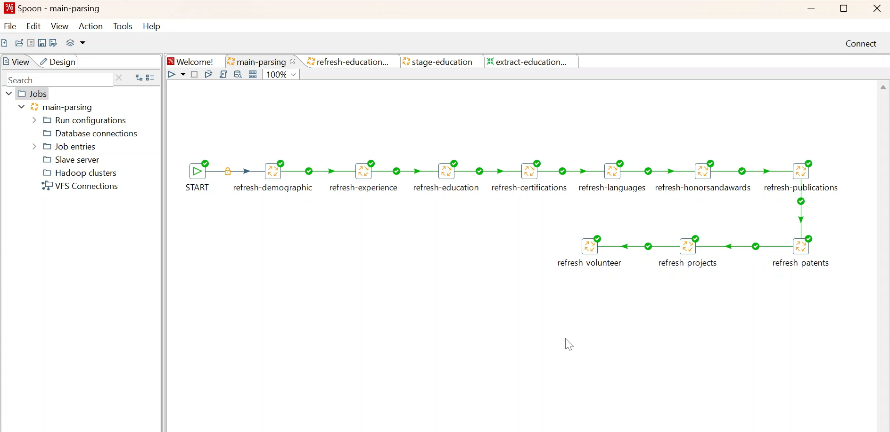
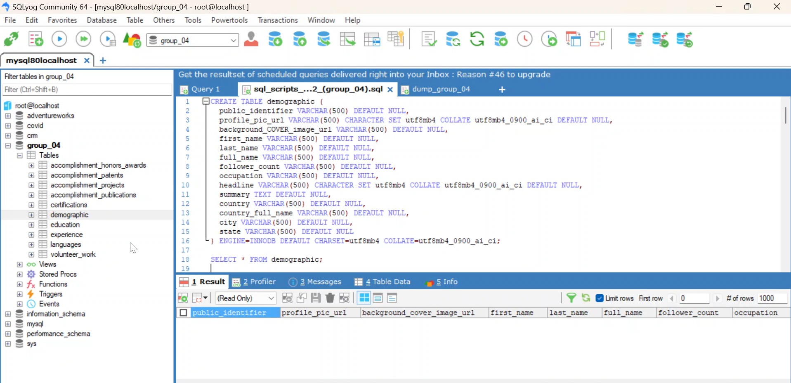
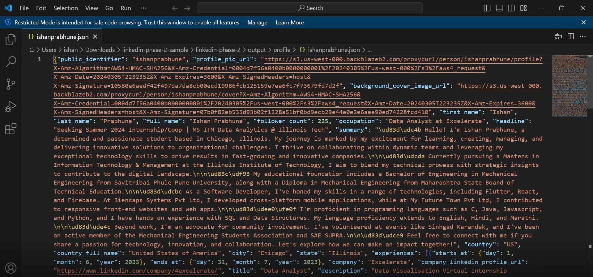
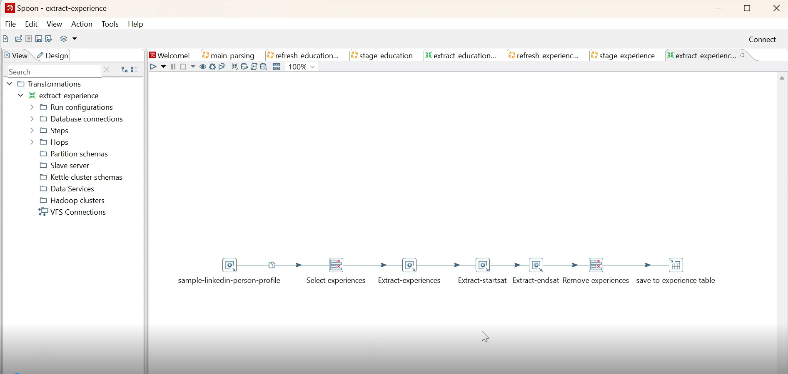
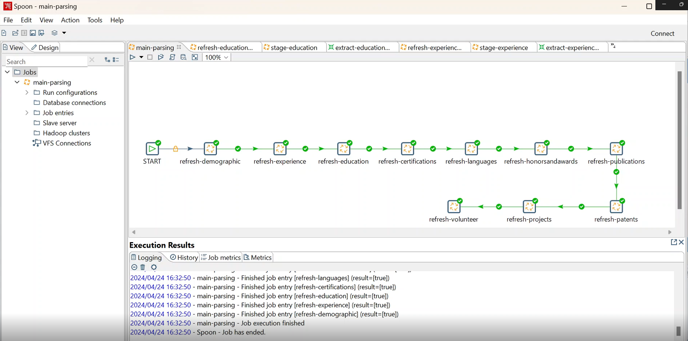
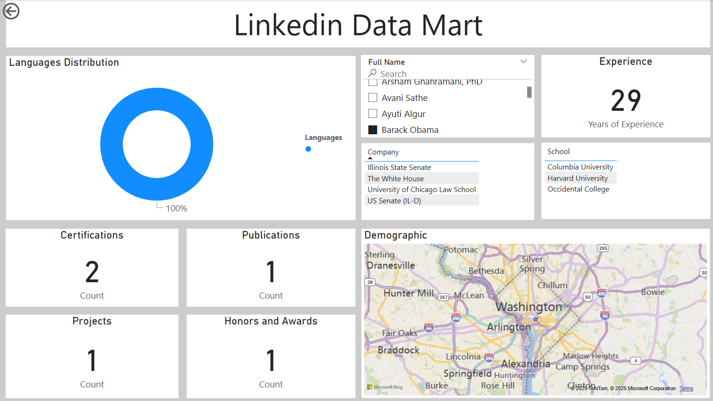

# LinkedIn Data Mart ETL Project

## Overview
This project involves building an ETL (Extract, Transform, Load) pipeline to process LinkedIn profile data stored in JSON files. We use Pentaho (Kettle) for the ETL process to extract relevant data, populate SQL tables, and visualize the results using Power BI.

## Table of Contents
- [Overview](#overview)
- [Data Pipeline](#data-pipeline)
- [Tables Created](#tables-created)
- [ETL Process](#etl-process)
- [Data Visualization](#data-visualization)
- [Technologies Used](#technologies-used)
- [How to Run](#how-to-run)

## Data Pipeline
The data pipeline involves the following key stages:
1. **Refresh Stage**: Prepares the data for extraction.
2. **Stage Pipeline**: Organizes and structures the incoming data.
3. **Extract Pipeline**: Extracts the required data from the JSON files and loads it into SQL tables.

  
*Overview of main ETL pipleline*

## Tables Created
We have created the following tables based on the LinkedIn profile JSON data:
- [Education, Experience, Demographic, Projects, Certifications, Languages, Patents, Publications, Awards]

  
*Overview of SQL Tables*

  
*Overview of Json Scripts*

These tables store the necessary information such as individual profiles, companies, certifications, and more.

## ETL Process
The ETL process uses **Pentaho (Kettle)** to connect, parse, and load the data into MySQL tables. The main pipeline handles all the stages of data processing:
- **Refresh**: Initiates the process.
- **Stage**: Prepares the data for extraction.
- **Extract**: Extracts data from the LinkedIn JSON profile files and loads it into the tables.

  
*Overview of experience data ETL pipleline*

### Flow of the Pipeline
When the main parsing pipeline is executed:
1. The **Refresh** pipeline triggers the **Stage** pipeline.
2. The **Stage** pipeline then triggers the **Extract** pipeline.
3. Finally, the **Extract** pipeline loads the parsed data into the respective SQL tables.

Once the entire pipeline is run, all necessary tables are populated with relevant data.

  
*Successful run of main ETL pipleline*

## Data Visualization
For visualizing the data, we connect the MySQL database to **Power BI**. The visualizations created include:
- **Donut Chart**: Displays the language distribution.
- **Map Visualization**: Shows demographic information regarding the cities where individuals, companies, or schools are located.
- **Cards**: Display metrics such as the number of certifications and patents per person.
- **Bar Chart**: Shows the count of certifications and the respective companies providing them.
- **Search Capability**: Allows users to search by individual names or schools, displaying the relevant data.

## Technologies Used
- **Pentaho (Kettle)**: For building the ETL pipeline.
- **MySQL**: As the relational database to store extracted data.
- **Power BI**: For data visualization.
- **JSON**: For storing LinkedIn profile data.

## How to Run
1. **Set up the SQL tables** by running the provided SQL scripts.
2. **Run the Pentaho ETL pipeline** to extract and load the data into the SQL tables.
3. **Connect the MySQL database to Power BI** for visualization.

